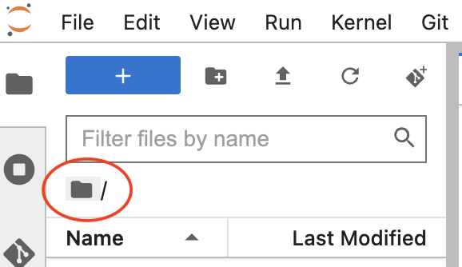
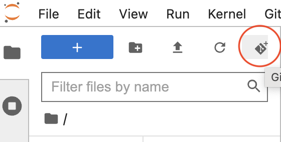

# Introduction to Machine Learning using `scikit-learn`

This repository contains lecture notebooks and practice sets for introductory machine learning material.  

## Instructions for accessing practice exercises 
- Go to https://pims.syzygy.ca/ and sign in. (You'll find the "sign in" option at the top right.)
- Go to the root folder by clicking on the folder icon.    
- Click on the Git clone icon.
  
- Paste the following GitHub repository URL in the "Enter the URL of the remote Git repository" box: https://github.com/UBC-MDS/intro-to-ml-workshop
- Check the "Include submodules" option
- You are all set! 